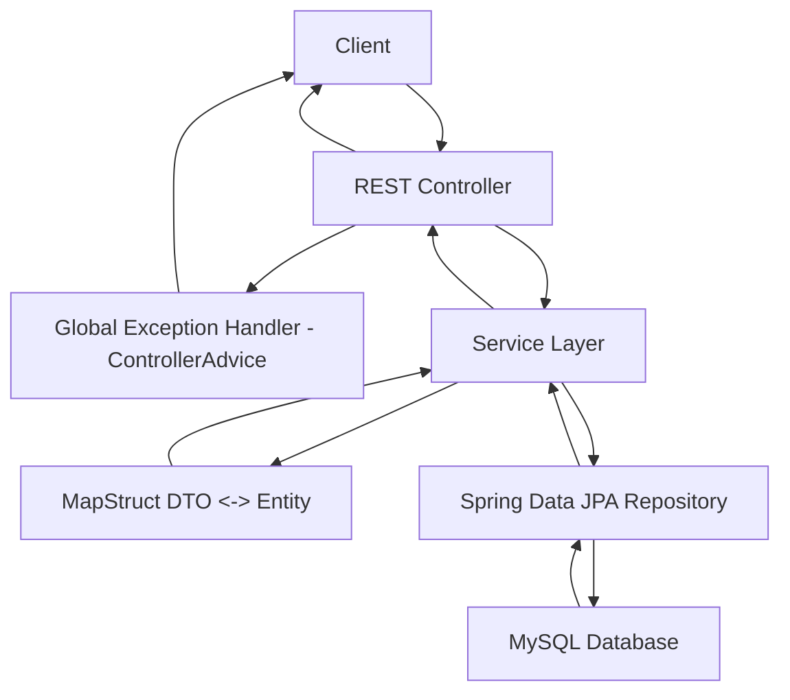

# 🌐 Spring Boot Application Architecture




# 🔄 Spring Boot Request Flow - Sequence Diagram

```mermaid
sequenceDiagram
    participant C as Client
    participant Ctrl as REST Controller
    participant S as Service Layer
    participant M as MapStruct Mapper
    participant R as Spring Data JPA Repository
    participant DB as MySQL Database
    participant E as Global Exception Handler

    C->>Ctrl: Send HTTP Request
    Ctrl->>S: Call service method
    S->>M: Convert DTO to Entity
    M-->>S: Return Entity
    S->>R: Save or Fetch Entity
    R->>DB: Execute SQL Query
    DB-->>R: Return Result
    R-->>S: Return Entity
    S->>M: Convert Entity to DTO
    M-->>S: Return DTO
    S-->>Ctrl: Return DTO
    Ctrl-->>C: Send HTTP Response

    alt Error occurs
        Ctrl->>E: Forward Exception
        E-->>C: Return Error Response
    end

